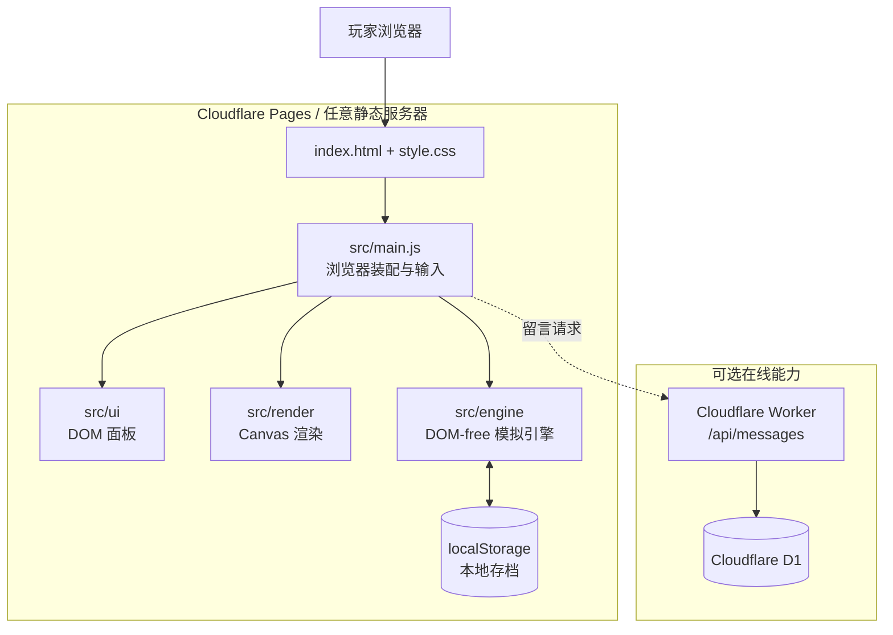
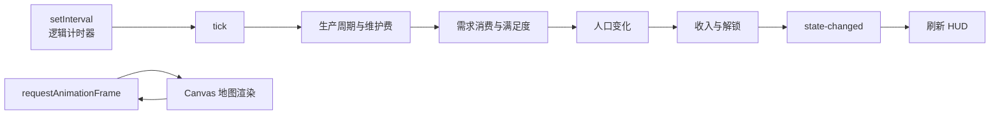
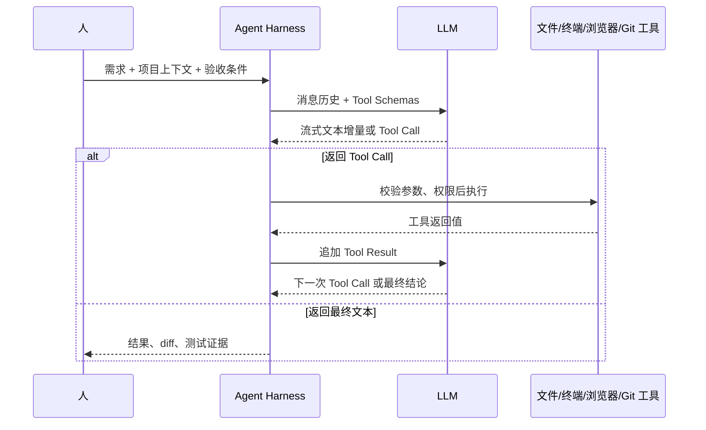

# 蒸汽都市（web1800）

> 使用原生 JavaScript 编写的工业时代城市模拟经营游戏，可直接在浏览器中运行。

在线试玩：<https://web1800.top>

本仓库是公开作品集镜像。游戏可以直接在浏览器中运行，核心模拟不依赖云端服务；留言板使用独立的 Cloudflare Worker + D1，后端不可用时不会影响游戏主体。

## 目录

- [项目内容](#项目内容)
- [运行架构](#运行架构)
- [关键数据流](#关键数据流)
- [开发方式：Vibe Coding](#开发方式vibe-coding)
- [关键 Prompt](#关键-prompt)
- [AI 调用逻辑](#ai-调用逻辑)
- [本地运行与测试](#本地运行与测试)
- [部署到 Cloudflare](#部署到-cloudflare)
- [DNS 与 HTTPS](#dns-与-https)
- [留言板 Worker 与 D1](#留言板-worker-与-d1)
- [安全与公开边界](#安全与公开边界)

## 项目内容

《蒸汽都市》把生产链、城市规划、人口需求和物流覆盖放进一个原生 JavaScript 模拟引擎中。

- 160×160 主岛与可探索新岛，包含水域、平地、山脉、矿脉和区域禀赋
- 生产链、周期生产、维护费、劳动力门槛和仓库覆盖
- 农民、工人、工匠等人口阶层及独立需求
- 3×3 住宅、住宅升级、道路等级和多格建筑 footprint
- 造船、舰队调遣、近海探索和岛间持续运输
- Canvas 地图、DOM HUD、生产链总览、小地图和昼夜表现
- `localStorage` v2 世界存档、旧档迁移、永久原档备份和转移工具
- Cloudflare Worker + D1 留言板，可在纯离线环境中降级

当前公开镜像的数据规模为 67 种建筑、64 种商品/资源和 5 个人口阶层；自动化测试基线为 174/174。

## 运行架构



### 分层说明

| 层 | 目录 | 职责 |
|---|---|---|
| 数据层 | `src/engine/data/` | 商品、需求、建筑、地图和平衡数据 |
| 世界与海事 | `world-data.js`、`ships.js`、`explorations.js`、`transport.js` | 多岛状态、船队、探索和岛间运输 |
| 状态与模拟 | `src/engine/state.js`、`tick.js` | 初始状态、时间推进和顶层模拟编排 |
| 领域逻辑 | `economy.js`、`population.js` | 生产、维护费、人口、需求、幸福度与收入 |
| 空间规则 | `placement.js`、`connectivity.js` | footprint、旋转、放置、道路与仓库连通 |
| 存档 | `save.js`、`src/tools/save-transfer.js` | JSON 序列化、v1→v2 迁移、永久原档与跨域转移 |
| 展现层 | `src/render/`、`src/ui/` | Canvas 地图和 DOM 面板，不复制模拟公式 |
| 浏览器装配 | `src/main.js` | 输入、计时器、自动保存、事件订阅和留言请求 |
| 可选后端 | `workers/messages-worker.js` | 留言 CRUD、管理员回复、D1 访问 |

### 双端引擎

`src/engine/` 不依赖 DOM。每个模块同时支持浏览器和 Node：

```js
root.Engine.moduleName = api;
if (typeof module !== 'undefined' && module.exports) module.exports = api;
```

因此浏览器运行和 Node 测试使用的是同一套模拟逻辑。UI 只调用引擎 API 和读取状态，不在界面层重新实现经济公式。

### 技术取舍

项目没有使用前端框架和构建工具。当前规模下，原生方案足够支撑界面和模拟逻辑，也省去了构建产物与源码之间的排查成本。浏览器和 Node 测试直接加载同一套引擎文件，静态部署时复制运行文件即可。

## 关键数据流

### 逻辑 tick 与渲染帧分离



逻辑模拟由 `setInterval` 驱动，地图动画由 `requestAnimationFrame` 驱动。两者分离后，模拟规则可以在 Node 中稳定测试，Canvas 也不会成为经济逻辑的隐式依赖。

### 存档

```text
运行状态
→ JSON 序列化
→ localStorage
→ 重新进入时读取和归一化
→ 损坏时保留原文备份并回退到新游戏
```

游戏主体不上传玩家存档。更换域名、浏览器或设备时，`localStorage` 不会自动迁移。

## 开发方式：Vibe Coding

项目从自然语言需求开始，但按小步迭代推进。玩法、数值和范围由人确定；Agent 在指定范围内读取代码、修改实现并运行测试。每轮通常处理 3～4 项，确认没有破坏现有规则后再继续。

| 环节 | 人 | Agent |
|---|---|---|
| 需求 | 确定玩法、数值口径和优先级 | 整理涉及的模块与待确认项 |
| 实现 | 确认范围和架构边界 | 修改代码、补测试和数据脚本 |
| 验收 | 检查操作感受和最终取舍 | 运行测试、浏览器检查和部署脚本 |
| 返工 | 判断问题属于需求还是实现 | 根据报错或复现步骤定位调用链 |

### 一轮迭代

```text
自然语言需求
→ 写成规则与验收条件
→ Agent 读取现有实现
→ 先复现问题或增加失败测试
→ 最小范围实现
→ npm test
→ 浏览器 smoke
→ 检查 diff 与部署白名单
→ 人确认后进入下一轮
```

代码合入前运行 `npm test`。界面改动在浏览器中检查，部署改动重新组装 `deploy/` 并验证线上地址。

### 项目上下文

需求和设计决定写在仓库里，不依赖单次对话记录：

- `requirements.md` 记录已确认规则
- `architecture.md` 记录模块边界和数据流
- `decisions.md` 记录已经采用的方案
- `status.md` 记录当前版本和验证基线
- 回归测试保留已经修过的边界条件
- 公开镜像同步代码、测试和可复现项目文档；正式站点仍由部署白名单排除 `docs/`、`AGENTS.md` 与 Git 历史

## 关键 Prompt

以下模板分别用于功能开发和缺陷修复，尖括号内容按本轮任务填写。

### 功能实现 Prompt

```text
项目：web1800

开始前读取与本任务相关的代码和测试，确认现有调用链。

目标：<一句话描述玩家可见结果>
范围：本轮只允许修改 <文件或模块>，不要顺手重构其他系统。

必须保持：
1. src/engine/ 不访问 DOM；
2. 浏览器与 Node 共用同一套引擎逻辑；
3. UI 不复制经济公式；
4. 不新增第三方依赖；
5. 跨模块依赖必须遵守现有脚本加载顺序。

验收条件：
- <成功路径>
- <失败路径>
- <状态守恒或精确数值>
- npm test 全部通过
- 浏览器中无 JavaScript 错误
- git diff --check 通过

执行顺序：读取 → 增加失败测试 → 最小实现 → 完整测试 → 汇总改动和测试结果。
如果需求与现有规则冲突，列出冲突并暂停实现。
```

### 缺陷修复 Prompt

```text
问题：<玩家看到的现象>
基线：<完整 commit SHA>

处理顺序：
1. 记录最小复现、实际结果和预期结果；
2. 写一个能在旧代码上失败的回归测试；
3. 定位根因并修复必要调用点；
4. 检查同一旧口径是否仍出现在引擎、UI、存档和测试中；
5. 运行完整测试与相关浏览器场景；
6. 分别记录本地测试、提交、推送和线上验证状态。
```

每次任务都会写明当前状态、目标、修改边界、验收条件和需要返回确认的问题。缺少玩法决定时，任务停在代码调查阶段，不进入实现。

## AI 调用逻辑

AI 只用于开发，游戏运行时没有大模型请求，也不需要 API Key。Hermes Agent 负责组织消息、工具定义和执行结果，编码任务也可以交给 Codex 等 Agent。



### 流式输出（streaming）

模型响应以 token/delta 逐步返回，桌面端同步显示文本。Tool Call 的 JSON 参数接收完整后才会交给工具执行。

### Function Calling / Tool Calling

模型通过结构化请求选择工具。例如读取引擎文件：

```json
{
  "name": "read_file",
  "arguments": {
    "path": "src/engine/tick.js"
  }
}
```

Harness 根据工具名找到处理器，检查参数和权限后执行，再把返回值作为 `tool result` 加入下一轮消息。模型随后可以继续读取、写补丁或运行测试。

本项目常用的工具类型包括：

| 工具类别 | 用途 |
|---|---|
| 文件读取与搜索 | 查找实现和调用点 |
| Patch / Write | 修改指定文件 |
| Terminal | 运行 Node 测试、Git 和部署脚本 |
| Browser | 检查页面、交互和控制台错误 |
| GitHub | 推送镜像、检查仓库和部署状态 |
| Skills / Memory | 保存可复用流程和长期约束 |

互不依赖的读取或检查可以并行执行；会修改同一状态的操作保持串行。危险命令或外部写入仍由 Harness 的权限层控制。

Tool Call 和执行结果会分别记录。模型给出调用参数，Harness 执行操作；终端输出、文件 diff 和 Git 状态来自对应工具。

## 本地运行与测试

要求：Node.js 18+；本地预览需要可用的 `python` 命令。

```bash
git clone https://github.com/AmamiyaYui/web1800-mirror.git
cd web1800-mirror

# 自动化测试
npm test

# 本地静态服务器
npm run serve
# 浏览器打开 http://localhost:8000
```

也可以直接双击 `index.html`。使用本地 HTTP 服务器更接近线上环境，留言板 API 在未部署 Worker 时会自动降级。

## 部署到 Cloudflare

### 1. 部署静态游戏

1. 登录 Cloudflare，进入 **Workers & Pages**。
2. 选择 **Create → Pages → Connect to Git**。
3. 连接 GitHub，并选择这个仓库或自己的 fork。
4. 使用下面的构建配置：

```text
Framework preset: None
Build command: bash tools/deploy.sh
Build output directory: deploy
Root directory: /
```

5. 保存并部署。Cloudflare 会运行 `tools/deploy.sh`，只把运行所需文件组装进 `deploy/`。
6. 首次部署完成后，先使用 `*.pages.dev` 地址验证页面和静态资源。

发布目录只包含：

```text
index.html
admin.html
save-transfer.html
style.css
src/
assets/
```

浏览器会下载并执行 JavaScript，因此运行代码可以通过开发者工具查看。`tools/deploy.sh` 只负责控制正式站点的文件范围，排除 `.git/`、内部文档、工具脚本和历史记录。

### 2. 自动部署

Pages 连接 Git 后，向生产分支推送会触发新的构建。推荐顺序：

```text
修改
→ npm test
→ bash tools/deploy.sh
→ 检查 deploy/
→ commit / push
→ 等待 Pages 构建完成
→ 验证 pages.dev 与自定义域名
```

## DNS 与 HTTPS

当前线上域名为 `web1800.top`，DNS 由 Cloudflare 托管，HTTPS 证书由 Cloudflare 自动签发和续期。

### DNS 做什么

DNS 负责把 `web1800.top` 指向 Cloudflare Pages。若域名还不在 Cloudflare：

1. 在 Cloudflare 选择 **Add a site**，输入域名。
2. Cloudflare 会分配一对权威名称服务器（NS）。
3. 到域名注册商后台，把原 NS 替换成 Cloudflare 给出的 NS。
4. 等待 DNS 传播。通常几分钟到数小时，极端情况可能需要 48 小时。
5. 在 Pages 项目中打开 **Custom domains**，添加 `web1800.top`。
6. Cloudflare 会创建或提示创建对应 DNS 记录。

不要把 `deploy/` 当成 DNS 目标。DNS 指向的是 Pages 提供的站点，`deploy/` 只是构建时产生的发布目录。

### HTTPS 做什么

HTTPS 在浏览器和 Cloudflare 边缘节点之间提供加密与站点身份校验。绑定自定义域名后，Cloudflare 通常会自动申请证书，不需要手动购买或上传证书。

建议在 Cloudflare 中：

- 保持 DNS 记录经过 Cloudflare 代理
- 开启 **Always Use HTTPS**，把 HTTP 跳转到 HTTPS
- 等证书状态变为 Active 后再正式分享域名
- 若配置 `www.web1800.top`，将它作为额外自定义域名并重定向到主域

### 验证命令

```bash
# 权威 NS 是否已经切到 Cloudflare
nslookup -type=NS web1800.top 8.8.8.8

# HTTPS 是否可访问、是否经过 Cloudflare
curl -I https://web1800.top

# 查看证书主题、签发者和有效期
openssl s_client -connect web1800.top:443 -servername web1800.top </dev/null 2>/dev/null \
  | openssl x509 -noout -subject -issuer -dates
```

只看到 DNS 生效不等于 HTTPS 已经签发；反过来，Pages 的 `pages.dev` 可访问也不代表自定义域名已经完成 NS 传播。这两步应分别验证。

## 留言板 Worker 与 D1

留言板是可选后端。静态游戏部署完成后，即使不配置这一部分，核心模拟仍可运行。

### 1. 创建 D1 数据库

在 Cloudflare 控制台创建一个 D1 数据库，然后执行：

```sql
CREATE TABLE IF NOT EXISTS messages (
  id INTEGER PRIMARY KEY AUTOINCREMENT,
  nick TEXT,
  text TEXT,
  ts INTEGER,
  is_dev INTEGER DEFAULT 0,
  parent_id INTEGER,
  status TEXT DEFAULT 'new'
);
```

### 2. 创建 Worker

1. 创建一个 Cloudflare Worker。
2. 将 `workers/messages-worker.js` 作为 Worker 入口代码。
3. 添加 D1 Binding：变量名必须是 `DB`，绑定刚创建的数据库。
4. 添加 Secret：`ADMIN_KEY`。不要把真实值写进仓库或前端代码。
5. 部署 Worker。

### 3. 配置路由

给 Worker 添加路由：

```text
web1800.top/api/*
```

Pages 继续处理静态页面，Worker 只接管 `/api/`。前端使用同源相对路径 `/api/messages`，因此不需要把 Worker 域名或密钥写进浏览器代码。

### 4. 验证 API

```bash
# 公开读取
curl https://web1800.top/api/messages

# 玩家留言
curl -X POST https://web1800.top/api/messages \
  -H 'Content-Type: application/json' \
  -d '{"nick":"tester","text":"hello"}'
```

管理员回复、状态更新和删除操作需要请求头 `X-Admin-Key`。管理密钥只能保存为 Worker Secret；公开仓库和网页源码中不应出现真实值。

## 安全与公开边界

- 游戏运行时没有 LLM API Key，也不调用大模型
- 玩家存档保存在浏览器 `localStorage`，不会自动上传
- 管理密钥保存在 Cloudflare Worker Secret 中
- `tools/deploy.sh` 使用白名单组装发布目录，避免公开 `.git/` 和内部文件
- 浏览器端 JavaScript 天然可读，不能把“静态部署”误解为“源码不可见”
- 本项目使用原创命名和界面素材，不使用商业游戏的官方美术、角色或受版权保护内容

## 项目结构

```text
web1800/
├─ index.html / style.css       浏览器入口与界面样式
├─ admin.html                   留言管理页
├─ save-transfer.html           存档下载、恢复与跨域转移工具
├─ src/
│  ├─ engine/                   DOM-free 模拟引擎及多岛海事模块
│  ├─ render/                   Canvas 地图渲染
│  ├─ ui/                       DOM 面板
│  ├─ tools/                    浏览器端存档工具
│  └─ main.js                   浏览器装配、输入、自动保存
├─ tests/engine.test.mjs        Node 引擎测试
├─ docs/idea-to-project/        架构、需求、决策和验证记录
├─ tools/deploy.sh              Cloudflare Pages 发布目录组装
├─ workers/messages-worker.js   留言板 Worker + D1 API
└─ assets/                      图像和静态资源
```

## 合规声明

本项目为原创独立开发的学习与作品集项目。界面、命名和文本不使用任何商业游戏的官方美术、角色或受版权保护内容，与任何商业作品无官方关联。
